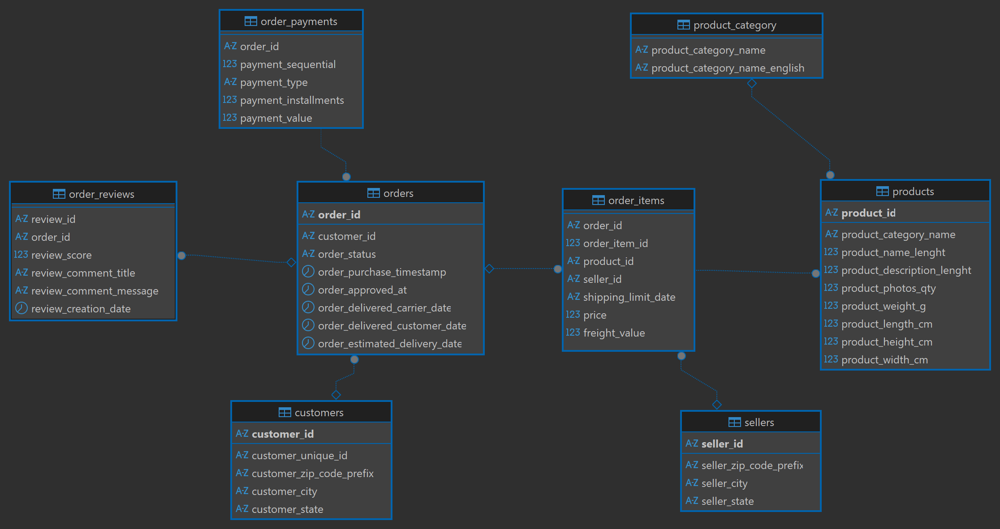

# E-commerce Data Analysis Using SQL

## 🎯 Project Objective
The goal of this project is to analyze transactional data from a Brazilian e-commerce platform to understand business performance, customer behavior, and operational efficiency. The analysis focuses on identifying revenue trends, product performance, delivery efficiency, and customer satisfaction using SQL.

## 📊 Project Overview
Analyzed ~99K Brazilian e-commerce orders using MySQL to uncover business insights on revenue trends, customer behavior, and operational efficiency.

## 🎯 Key Findings
- **Customer Retention Crisis:** 97% are one-time buyers
- **Delivery Impact:** Delayed orders score 1.7 points lower (2.57 vs 4.29)
- **Revenue Leaders:** Health & Beauty (R$ 1.4M), Watches & Gifts (R$ 1.26M)
- **Geographic Concentration:** São Paulo generates 13.7% of total revenue, showing strong geographic concentration.

## 📁 Dataset
- **Source:** [Brazilian E-commerce (Kaggle)](https://www.kaggle.com/datasets/olistbr/brazilian-ecommerce)
- **Period:** September 2016 - August 2018 (773 days)
- **Scale:** 99K orders | 113K items | 33K products | 3K sellers

## 🛠️ Tools Used
- **Database:** MySQL 8.0
- **SQL Client:** DBeaver
- **Skills:** JOINs, Window Functions, Subqueries, CASE statements

## 📐 Database Schema


## 🔍 Analysis Sections

### 0. Data Exploration
- Validated 8 tables with 99K+ rows
- Verified 773 days of continuous data
- Checked for NULL values in critical columns

### 1. Business Overview (4 queries)
- Total Revenue: **R$ 15.4M**
- Unique Customers: **93,358**
- Average Order Value: **R$ 159.88**
- Monthly revenue peaked at **R$ 1.15M** (Nov 2017)

### 2. Product Analysis (4 queries)
- Best-selling item: Furniture & Decor (520 units)
- Top category: **Health & Beauty** (R$ 1.4M)
- Premium pricing: Computers avg **R$ 1,098**
- High freight costs: Some products cost **281% of product price** in shipping

### 3. Customer Analysis (4 queries)
- **97% one-time customers** - major retention gap
- São Paulo: 15K customers, 13.7% of revenue
- Repeat buyers purchase again after ~81 days on average

### 4. Logistics & Delivery (3 queries)
- **91.9% on-time delivery rate**
- SP delivers in 8.8 days, RR takes 29.4 days
- 1,729 orders still in transit

### 5. Payment Analysis (2 queries)
- **74% use credit cards**
- 51% prefer single payment
- Installment plans show R$ 415 avg value

### 6. Customer Satisfaction (2 queries)
- **58% give 5-star reviews**
- Delayed deliveries: **2.57 avg score** vs 4.29 on-time
- Books category: highest rating (4.45)

### 7. Seller Performance (1 query)
- Top seller: R$ 247K revenue (1.6% of total)
- Top 10 sellers: 14% of total revenue
- Month-over-month (MoM) revenue growth analysis

## 💡 Business Recommendations

### 1. Fix Customer Retention (Priority: HIGH)
**Problem:** 97% never return  
**Impact:** R$ 14M+ potential lost revenue  
**Actions:**
- Launch email remarketing campaigns
- Offer 10% discount on second purchase
- Implement loyalty points program

### 2. Improve Northern Delivery (Priority: MEDIUM)
**Problem:** RR, AP, AM states take 26-29 days  
**Impact:** Lower satisfaction in these regions  
**Actions:**
- Partner with regional logistics providers
- Set realistic delivery expectations upfront

### 3. Expand Beyond São Paulo (Priority: MEDIUM)
**Finding:** SP generates 13.7% of revenue  
**Opportunity:** Other major cities underperforming  
**Actions:**
- Targeted marketing in Rio, Brasília, Belo Horizonte
- State-specific promotions

### 4. Leverage Premium Categories (Priority: LOW)
**Finding:** High-value categories (Computers avg R$ 1,098) show low sales volume  
**Opportunity:** Focus marketing on premium segments for higher margins  
**Action:** Create targeted campaigns for premium products

## 📂 Repository Structure
```
├── queries/
│   └── ecommerce_analysis.sql    # Complete analysis (22 queries)
├── schema/
│   └── er_diagram.png             # Database relationships
└── README.md                       # Project documentation
```

## 🚀 SQL Concepts Demonstrated
- Multi-table JOINs (up to 4 tables)
- Window Functions: LEAD, LAG, RANK, ROW_NUMBER
- Subqueries (nested and scalar)
- CASE statements for conditional logic
- Date functions: TIMESTAMPDIFF, DATE_FORMAT, DATEDIFF
- Aggregate functions with GROUP BY and HAVING

## 📈 Key Metrics
| Metric           | Value     |
|------------------|-----------|
| Total Revenue    | R$ 15.4M  |
| Orders           | 96,478    |
| Customers        | 93,358    |
| Avg Order Value  | R$ 159.88 |
| Repeat Rate      | ~3%       |
| On-Time Delivery | 91.9%     |
| 5-Star Reviews   | 57.8%     |

## 📧 Connect With Me
**Inderjeet Singh**  
📧 Email: inderjeetsingh152005@gmail.com  
💼 LinkedIn: https://www.linkedin.com/in/inderjeet-singh01/  
💻 GitHub: https://github.com/inderjeet-singh-data

---
*Portfolio project for Data Analyst positions | March 2026*
